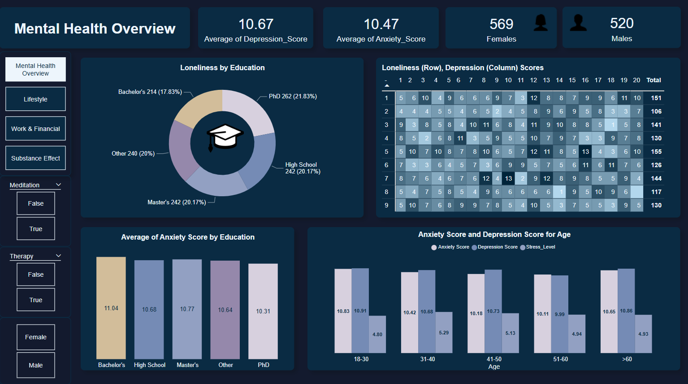
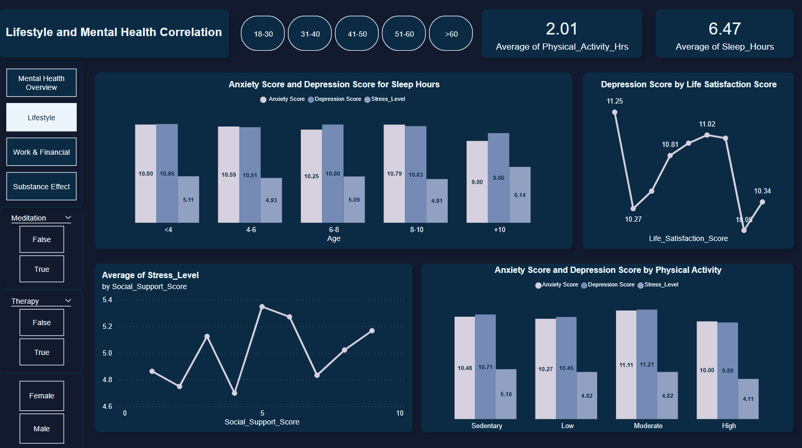
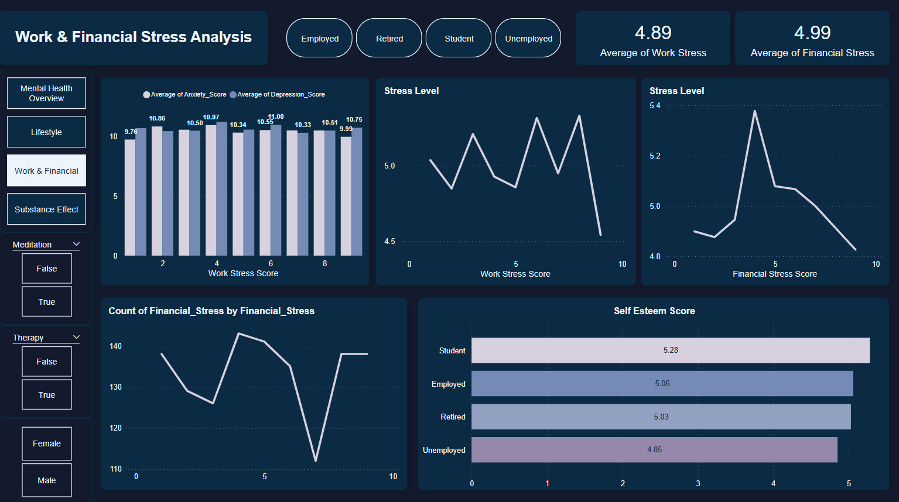
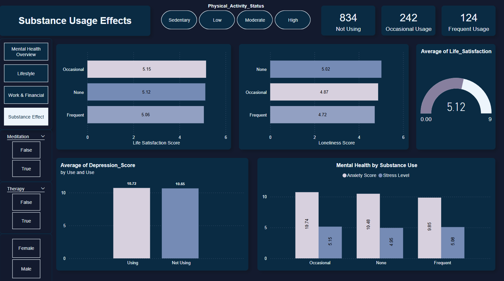

# Mental Health Analysis

## Project Overview

This project presents a comprehensive analysis of mental health data, utilizing Python for data preprocessing and Power BI for visualization. The goal is to uncover patterns and insights related to mental health issues, aiding in better understanding and awareness.

---

## Technologies Used
- Python (Pandas, NumPy, Matplotlib, Seaborn)
- Google Colab
- Power BI
  
You can access the Colab notebook for data cleaning and preprocessing [here](https://colab.research.google.com/drive/1sPSMhYB8AMNWrOgmaXI8oAHdYMWGKp7v?usp=sharing).

Data from [**Kaggle**](https://www.kaggle.com/datasets/ak0212/anxiety-and-depression-mental-health-factors).

---
## Report Screenshots

### 1. Mental Health Overview

- Anxiety and depression scores are highest among Bachelor's degree holders.
- The loneliness heatmap shows strong correlations with depression levels.

---

### 2. Substance Usage Effects

- People with more than 10 hours of sleep tend to have lower stress and depression scores.
- Moderate physical activity is associated with lower anxiety and depression scores.
- Higher social support correlates with lower stress levels.

---

### 3. Work & Financial Stress Analysis

- Students have the highest self-esteem scores, while the unemployed have the lowest.
- Financial stress tends to decrease after a certain threshold.

---

### 4. Lifestyle and Mental Health Correlation

#### Insights:
- Frequent substance users have lower life satisfaction.
- Depression and anxiety scores are slightly higher among those who use substances.
---

## Team Members
- [**Fayez**](https://github.com/Fayez66)
- [**Abdulrahman Mohamed**](https://github.com/Abdulrahman-MA)
- [**Kerolos Fady**](https://github.com/Kero-fady)
<!-- ## Documentation 
[Documentation](Reports/Objectives.docx)
-->

---

### If you find this project useful, don’t forget to give it a star! ⭐ 

